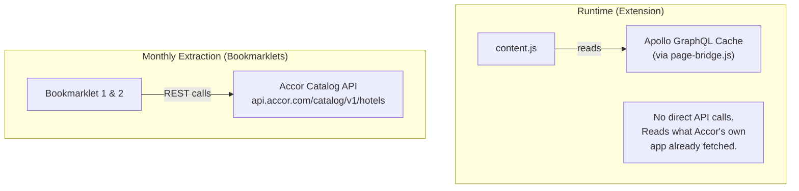
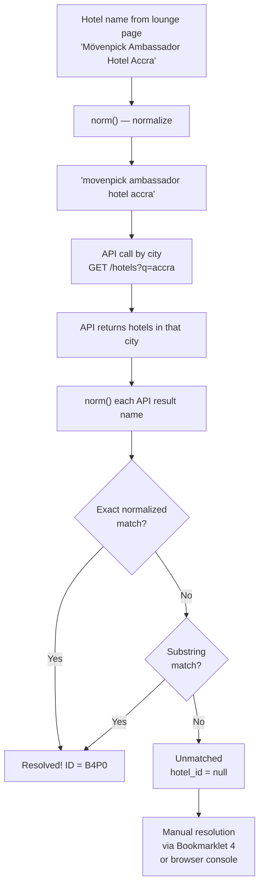
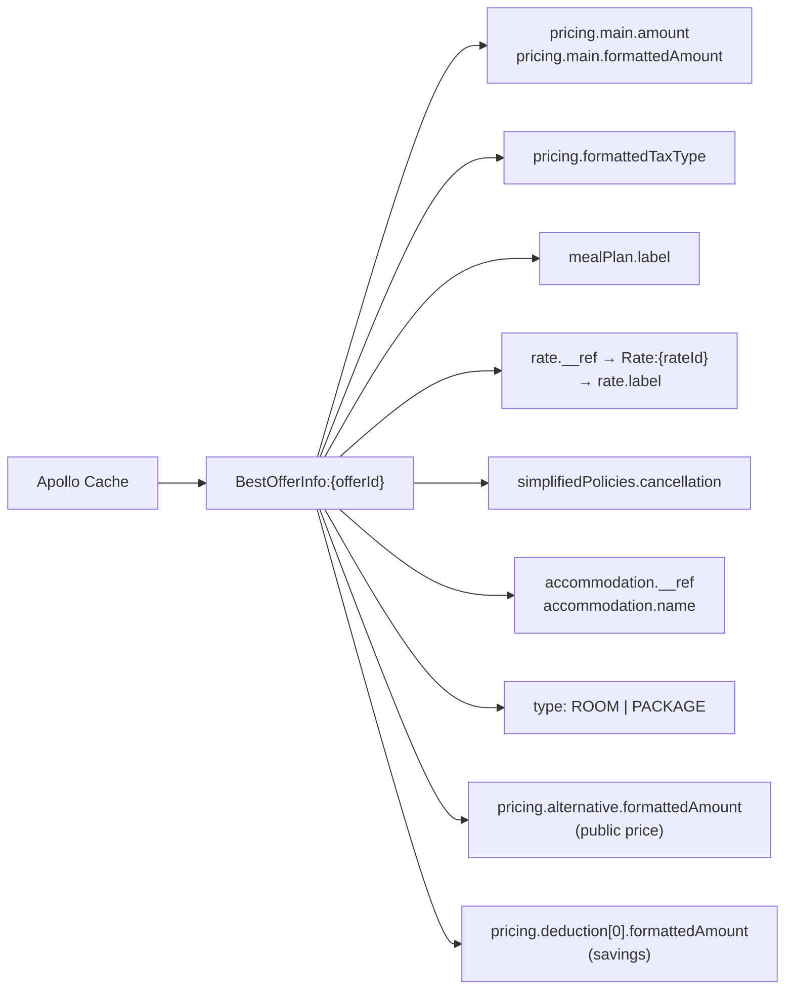
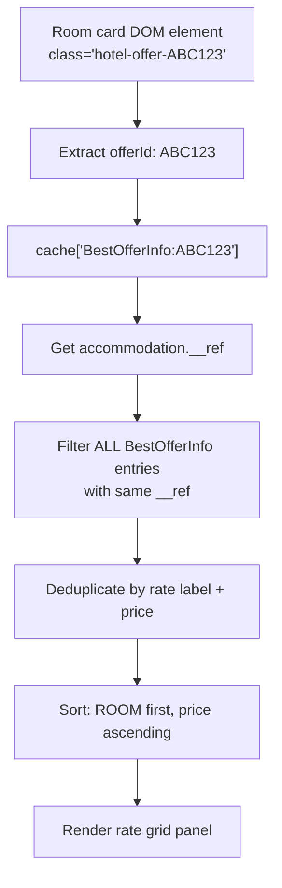

# API Integration & Hotel ID Resolution

## API Overview

The extension itself makes **zero API calls at runtime**. All API interaction happens during the monthly data extraction via bookmarklets.



## Accor Catalog API

### Endpoint

```
GET https://api.accor.com/catalog/v1/hotels
```

### Authentication

- **Header:** `apiKey`
- **Format:** Layer7 gateway key, 36 characters starting with `l7xx`
- **Capture method:** Intercepting `XMLHttpRequest.setRequestHeader` from the Accor page's own requests

### Parameters

| Parameter | Example | Description |
|-----------|---------|-------------|
| `q` | `bangkok` | Search query (city, region, or hotel name) |
| `sort` | `name` | Sort order (alphabetical) |
| `range` | `0-99` | Pagination (0-indexed, inclusive, max 100 per page) |
| `fields` | `results.hotel.name,...` | Comma-separated field paths to return |
| `label` | `COMPLIMENTARY_BREAKFAST` | Filter by hotel label |

### Response Status Codes

| Status | Meaning |
|--------|---------|
| `200` | Complete results (last page) |
| `206` | Partial content (more pages available) |

### Available Fields

```
results.hotel.name              # Hotel display name
results.hotel.id                # Hotel ID (e.g., "B4P0")
results.hotel.brand             # Brand code (e.g., "SOF", "PUL")
results.hotel.rating.star.score # Star rating (1-5)
results.hotel.rating.trustyou.score     # Review score
results.hotel.rating.trustyou.nbReviews # Review count
results.hotel.roomOccupancy.maxChildAge # Max child age
results.hotel.roomOccupancy.maxAdult    # Max adults
results.hotel.roomOccupancy.maxPax      # Max occupants
results.hotel.label             # Array: FAMILY_FRIENDLY, COMPLIMENTARY_BREAKFAST, etc.
results.hotel.amenity.free      # Array: pool, spa, restaurant, fitness, bar, etc.
results.hotel.coordinates       # Lat/lng
results.hotel.contact           # Phone, email
results.hotel.description       # Hotel description
results.hotel.openingDate       # Opening date
results.hotel.lastRenovationDate
results.hotel.loyaltyProgram
results.hotel.environment.ecoCertifications
```

### Key Constraint

> **There is NO API label or field for "Executive Lounge."**

The lounge hotel list exists ONLY in the HTML of the Accor loyalty page. The API is used solely to:
1. Resolve hotel IDs (matching names to IDs)
2. Enrich lounge hotels with stars, reviews, amenities, etc.
3. Load the full breakfast hotel list (via `label=COMPLIMENTARY_BREAKFAST`)

## Hotel ID Resolution

### The Problem

The Accor lounge HTML page lists hotel names but NOT hotel IDs. The extension needs IDs to match against `data-hotel-id` attributes on booking page cards.

### Resolution Pipeline



### Normalization Function

```javascript
function norm(n) {
  return n.toLowerCase()
    .replace(/[öô]/g, 'o')    // ö → o, ô → o
    .replace(/[éè]/g, 'e')    // é → e, è → e
    .replace(/[àá]/g, 'a')    // à → a, á → a
    .replace(/[üû]/g, 'u')    // ü → u, û → u
    .replace(/[ïî]/g, 'i')    // ï → i, î → i
    .replace(/ç/g, 'c')       // ç → c
    .replace(/[^\w\s]/g, '')   // Remove all non-alphanumeric (except spaces)
    .replace(/\s+/g, ' ')     // Collapse whitespace
    .trim();
}
```

### Match Rate

- **Automatic:** ~83% (245 of 309 in Feb 2026 baseline)
- **Manual resolution needed:** ~17% (64 hotels)

### Common Mismatch Patterns

| Pattern | Lounge Page | API Name | Root Cause |
|---------|-------------|----------|------------|
| Word spacing | `HaiPhong` | `Hai Phong` | Concatenated city name |
| Word order | `Hong Kong Century` | `Century Hong Kong` | Different name ordering |
| Abbreviation | `BKK1` | `BKK 1` | Missing space |
| Punctuation | `Jing An` | `Jing'an` | Apostrophe vs space |
| Truncation | `Rabat Salé Hotel And Residences` | `Rabat-Salé` | Shortened name in API |

### Manual Resolution Methods

#### Method 1: Browser Console

Search on `all.accor.com/booking/en/accor/hotels/{city-slug}`, then run:

```javascript
document.querySelectorAll('div.result-list-item[data-hotel-id]').forEach(card => {
  const id = card.getAttribute('data-hotel-id');
  const name = card.querySelector('h2')?.textContent?.trim();
  console.log(id + ' | ' + name);
});
```

#### Method 2: Bookmarklet 4 (Automated Backup)

Reads unmatched hotels from clipboard, searches each city on the booking site, and attempts brand+keyword matching:

```javascript
// Match logic: brand keyword + 50% word overlap
var brand = (normH.split(' ')[0] || '').toLowerCase();
if (normName.includes(brand)) {
  var words = normH.split(' ').filter(w => w.length > 3);
  var matchCount = words.filter(w => normName.includes(w)).length;
  if (matchCount >= Math.ceil(words.length * 0.5)) {
    data.hotels[h.idx][4] = id;  // Resolved!
  }
}
```

### Known Resolutions (Feb 2026)

| Lounge Page Name | Resolved ID | Accor Website Name |
|-----------------|-------------|-------------------|
| Movenpick Hotel & Residences Nairobi | B4Q7 | Movenpick Nairobi Hotel & Residences |
| Fairmont La Marina Rabat Sale Hotel And Residences | A7Z0 | Fairmont La Marina Rabat-Sale |
| Novotel Phnom Penh BKK1 | B2E8 | Novotel Phnom Penh BKK 1 |
| Novotel Hong Kong Century | 3562 | Novotel Century Hong Kong |
| Pullman Shanghai Jing An | 7598 | Pullman Shanghai Jing'an |
| Pullman HaiPhong Grand Hotel | B4S6 | Pullman Hai Phong Grand Hotel |

## Runtime Data: Apollo GraphQL Cache

At runtime, the extension reads (but doesn't call) the Accor website's Apollo cache for two features:

### 1. Show All Rates

Reads `BestOfferInfo:*` cache entries:



### 2. Tax-Inclusive Prices on Detail Pages

Reads the same `BestOfferInfo:` entries to compute total = base + tax for each room.

### Cache Key → Room Matching

Each room card on the detail page has a CSS class like `hotel-offer-ABC123`. The extension uses this to find `BestOfferInfo:ABC123` in the cache, then groups all offers with the same `accommodation.__ref` for that room type.



## API vs Runtime Data Comparison

| Aspect | Monthly API (Bookmarklets) | Runtime Cache (Extension) |
|--------|---------------------------|--------------------------|
| **When** | 1st of each month, manually | Every page load, automatically |
| **Source** | `api.accor.com/catalog/v1/hotels` | Accor page's Apollo cache |
| **Auth** | Captured `apiKey` header | None (reads page's own data) |
| **Data** | Hotel IDs, names, stars, reviews | Room rates, prices, taxes, meal plans |
| **Purpose** | Build hotel ID sets | Show all rates, compute tax totals |
| **Network** | Direct REST calls | No network (reads in-memory cache) |

---

*Back: [Data Pipeline & Monthly Update Workflow](Data-Pipeline-&-Monthly-Update-Workflow) | [Architecture Overview](Architecture-Overview)*
