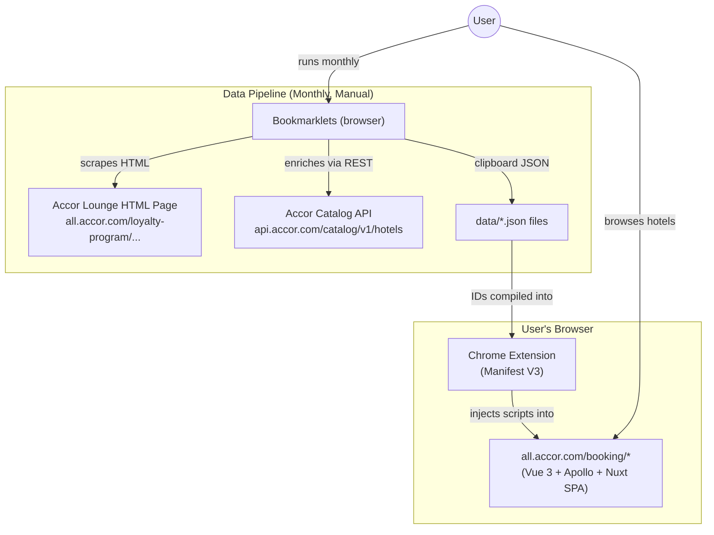
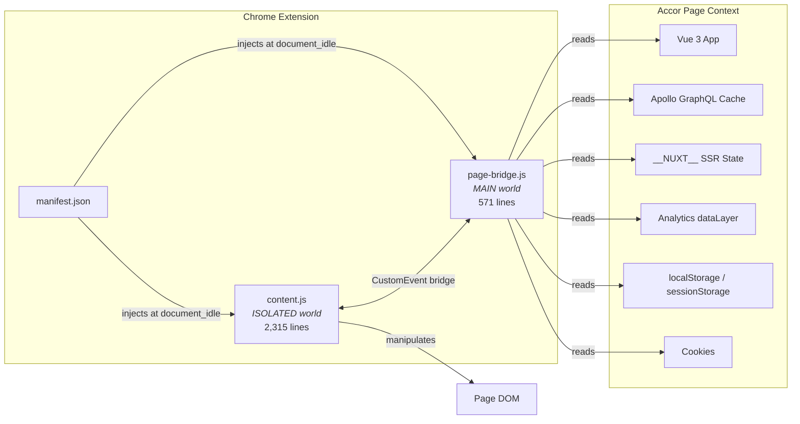
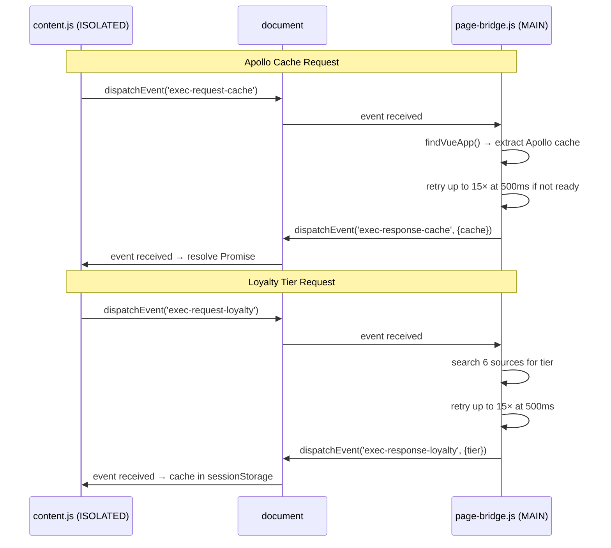
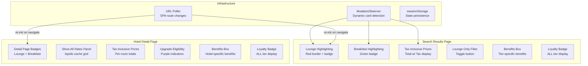
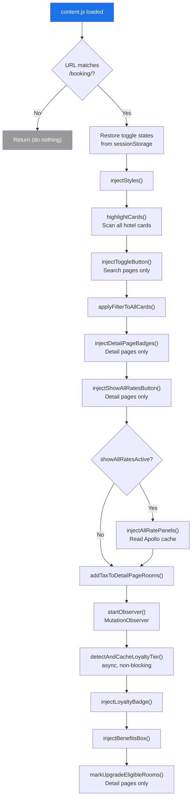

# Architecture Overview

> Accor Executive Lounge Highlighter v2.3 — Chrome Extension (Manifest V3)

## System Context



## Extension Architecture

The extension has **no popup, no background service worker, and no options page**. It consists of exactly two content scripts injected into Accor booking pages:



### Why Two Scripts in Two Worlds?

| Script | World | Can Access | Cannot Access |
|--------|-------|-----------|---------------|
| `page-bridge.js` | `MAIN` (page JS context) | `window.__NUXT__`, Vue app internals, Apollo cache, page globals | `chrome.*` extension APIs |
| `content.js` | `ISOLATED` (extension sandbox) | DOM, `chrome.*` APIs, extension storage | Page JavaScript globals |

The MAIN world script reads the Accor website's internal Vue/Apollo state. The ISOLATED world script does all DOM manipulation. They communicate via `CustomEvent` messages on `document`.

## Manifest Configuration

```json
{
  "manifest_version": 3,
  "name": "Accor Executive Lounge Highlighter",
  "version": "2.3",
  "incognito": "spanning",
  "host_permissions": ["https://all.accor.com/*"],
  "content_scripts": [
    {
      "matches": ["https://all.accor.com/booking/*"],
      "js": ["page-bridge.js"],
      "run_at": "document_idle",
      "world": "MAIN"
    },
    {
      "matches": ["https://all.accor.com/booking/*"],
      "js": ["content.js"],
      "run_at": "document_idle"
    }
  ]
}
```

Key decisions:
- **`document_idle`** — waits for DOM to be ready before injecting
- **`incognito: "spanning"`** — works in incognito mode
- **`world: "MAIN"`** for page-bridge — required to access Vue/Apollo internals
- **No background script** — all logic runs in content scripts only when the user is on an Accor booking page

## Inter-Script Communication



The bridge uses a request/response pattern with 4 custom events:

| Event | Direction | Payload |
|-------|-----------|---------|
| `exec-request-cache` | content → bridge | *(none)* |
| `exec-response-cache` | bridge → content | `{cache: {...}}` or `{error: "..."}` |
| `exec-request-loyalty` | content → bridge | *(none)* |
| `exec-response-loyalty` | bridge → content | `{tier, tierCode, source}` |

On the content.js side, each request is wrapped in a Promise with an 8-second timeout:

```javascript
function extractApolloCacheViaPageScript() {
  return new Promise((resolve) => {
    const timeout = setTimeout(() => {
      document.removeEventListener('exec-response-cache', handler);
      resolve(null);
    }, 8000);
    function handler(e) {
      clearTimeout(timeout);
      document.removeEventListener('exec-response-cache', handler);
      try {
        const data = JSON.parse(e.detail);
        resolve(data.error ? null : data.cache);
      } catch { resolve(null); }
    }
    document.addEventListener('exec-response-cache', handler);
    document.dispatchEvent(new CustomEvent('exec-request-cache'));
  });
}
```

## Feature Map



## Color System

| Color | Hex | Usage |
|-------|-----|-------|
| Red | `#e63946` | Executive Lounge highlights, badges, benefits box border |
| Green | `#0e8a16` | Free Breakfast badges, free cancellation, meal plans |
| Blue | `#1a73e8` | Show All Rates button |
| Purple | `#6b21a8` | Upgrade Eligible indicators |
| Dark | `#1a1a2e` | Text, Diamond tier badge |
| Gold | `#f5c518` | Gold tier badge |

## File Structure

```
Accor-Executive-Lounge/
├── manifest.json              # Extension manifest (MV3)
├── content.js                 # Main content script (2,315 lines, ISOLATED world)
├── page-bridge.js             # Page bridge script (571 lines, MAIN world)
├── README.md                  # Project overview
├── MONTHLY_UPDATE_GUIDE.md    # Operational guide with bookmarklet code
├── data/
│   ├── lounge/
│   │   └── 2026-02.json       # 309 lounge hotels (14 fields each)
│   └── breakfast/
│       └── 2026-03.json       # 7,403 breakfast hotels (7 fields each)
└── wiki/                      # Architecture documentation (this wiki)
```

## Tech Stack

- **Chrome Extension Manifest V3** — content scripts only, no popup/background
- **Vanilla JavaScript (ES2020+)** — async/await, Set, optional chaining, destructuring
- **Zero build tools** — no bundler, no transpiler, no npm. Load unpacked directly
- **Vue 3 / Apollo / Nuxt introspection** — reads the *host page's* framework state (not its own)
- **MutationObserver** — watches for dynamically loaded hotel cards (infinite scroll)
- **sessionStorage** — persists toggle states and loyalty tier across SPA navigation
- **CSS-in-JS** — all styles injected as a single `<style>` element, no external CSS files

## Initialization Flow



After `init()`, a `setInterval` polls `location.href` every 1 second to detect SPA route changes and re-initialize.

---

*Next: [Content Script Deep Dive](Content-Script-Deep-Dive) | [Page Bridge Deep Dive](Page-Bridge-Deep-Dive) | [Data Pipeline](Data-Pipeline-&-Monthly-Update-Workflow) | [API Integration](API-Integration-&-Hotel-ID-Resolution)*
