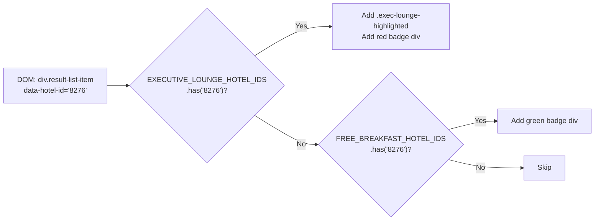
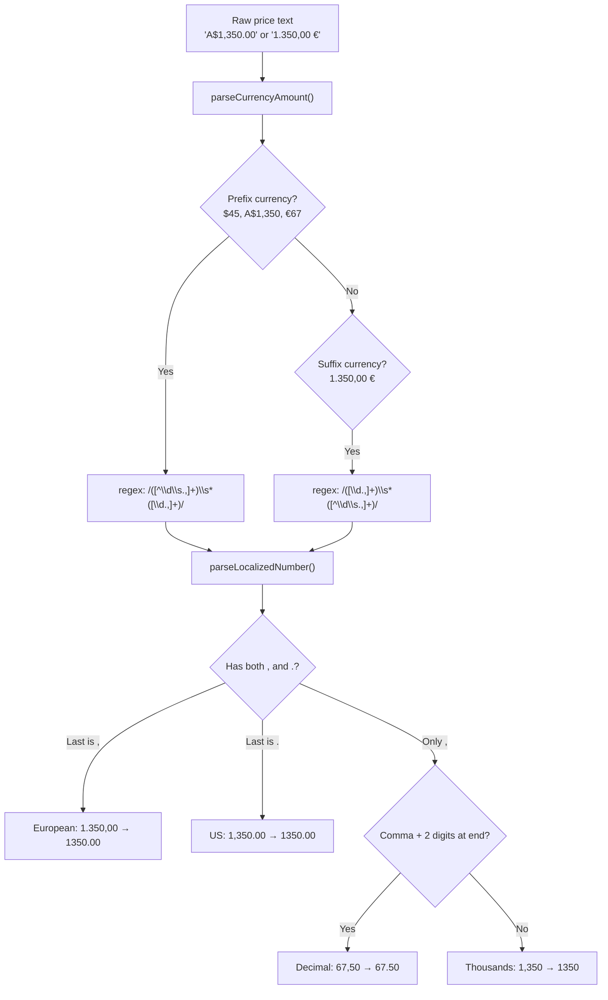
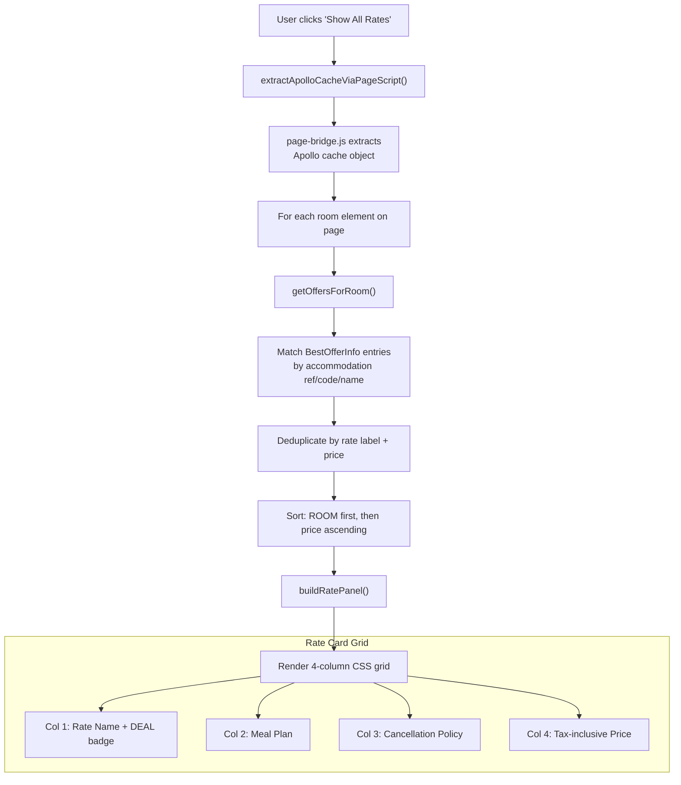
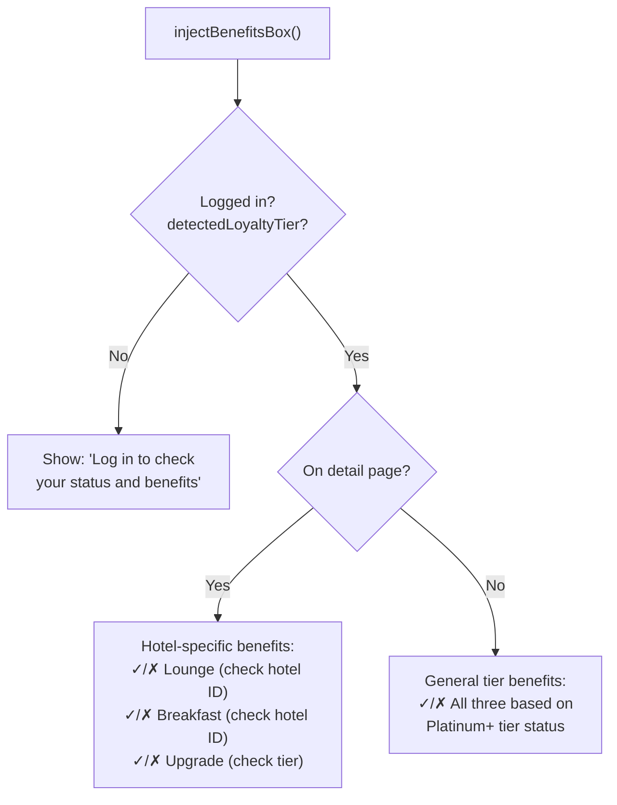
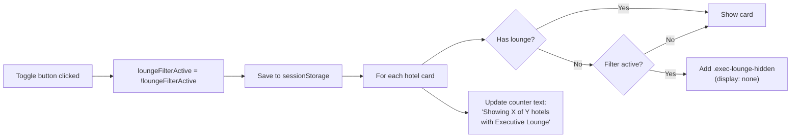

# Content Script Deep Dive

> `content.js` — 2,315 lines, runs in the ISOLATED world

## File Layout

```
Lines 1–6       Header and version comment
Lines 7–317     EXECUTIVE_LOUNGE_HOTEL_IDS Set (~309 IDs by region)
Lines 319–701   FREE_BREAKFAST_HOTEL_IDS Set (~3,759 IDs)
Lines 703–707   Toggle state initialization from sessionStorage
Lines 709–1097  injectStyles() — all CSS injected as a <style> element
Lines 1099–1137 highlightCard(), addBreakfastBadge(), highlightCards()
Lines 1139–1201 Hotel detail page badge injection
Lines 1203–1384 Price parsing: parseLocalizedNumber(), parseCurrencyAmount(), etc.
Lines 1386–1442 addTaxToDetailPageRooms() — detail page tax via Apollo cache
Lines 1444–1504 Apollo cache + loyalty detection bridge (Promise wrappers)
Lines 1506–1551 injectLoyaltyBadge()
Lines 1553–1609 Upgrade eligibility: ROOM_CATEGORY_KEYWORDS, markUpgradeEligibleRooms()
Lines 1611–1720 injectBenefitsBox()
Lines 1722–2012 Show All Rates: getOffersForRoom(), buildRatePanel(), injectAllRatePanels()
Lines 2014–2096 Page detection, room selectors, Show All Rates toggle
Lines 2098–2194 Filter toggle: applyFilterToCard(), injectToggleButton()
Lines 2196–2262 MutationObserver: startObserver(), stopObserver()
Lines 2264–2315 init() and route change watcher
```

## Hotel ID Sets

The two hardcoded `Set` objects are the core data source. They're compiled from monthly JSON extractions and embedded directly — **no runtime data loading**.

```javascript
const EXECUTIVE_LOUNGE_HOTEL_IDS = new Set([
  // ===== AFRICA =====
  // Ghana (1 hotels)
  'B4P0', // Mövenpick Ambassador Hotel Accra
  // ...
  // ===== ASIA =====
  // China (61 hotels)
  '8276', // Pullman Anshan Time Square
  // ... ~309 total IDs
]);

const FREE_BREAKFAST_HOTEL_IDS = new Set([
  // ~3,759 unique IDs extracted from 7,403 API results
  '0070', '0093', '0111', // ...
]);
```

`Set.has()` gives O(1) lookups — checking 309 or 3,759 IDs per card is instant.

## Card Highlighting



Each card is tagged with a data attribute to prevent double-processing:

```javascript
function highlightCard(card) {
  const hotelId = card.getAttribute('data-hotel-id');
  if (!EXECUTIVE_LOUNGE_HOTEL_IDS.has(hotelId)) return;
  if (card.getAttribute('data-exec-lounge-highlighted') === 'true') return;
  card.setAttribute('data-exec-lounge-highlighted', 'true');
  card.classList.add('exec-lounge-highlighted');
  const badge = document.createElement('div');
  badge.className = 'exec-lounge-badge';
  badge.textContent = 'Executive Lounge ✓';
  card.appendChild(badge);
}
```

Breakfast badges stack below lounge badges (top: 22px vs 4px). If a hotel has breakfast but no lounge, the badge shifts to `top: 4px` via the `.free-breakfast-only` class.

## Price Parsing

The extension handles international price formats across all Accor markets:



```javascript
function parseLocalizedNumber(str) {
  str = str.replace(/\s/g, '');
  if (str.includes(',') && str.includes('.')) {
    if (str.lastIndexOf(',') > str.lastIndexOf('.')) {
      return parseFloat(str.replace(/\./g, '').replace(',', '.')); // European
    }
    return parseFloat(str.replace(/,/g, '')); // US
  }
  if (str.includes(',')) {
    if (/,\d{2}$/.test(str) && (str.match(/,/g) || []).length === 1) {
      return parseFloat(str.replace(',', '.')); // Single decimal comma
    }
    return parseFloat(str.replace(/,/g, '')); // Thousands comma
  }
  return parseFloat(str);
}
```

### Tax-Inclusive Price Display

On search result cards, Accor shows base price and tax separately. The extension combines them:

```
BEFORE (Accor default):     AFTER (extension):
┌─────────────────────┐     ┌──────────────────────────────┐
│ A$242               │     │ Total: A$275 w/ Tax          │
│ + A$33 taxes        │     │ (A$92/night)                 │
│ 3 nights            │     │ From A$242 + Taxes A$33      │
└─────────────────────┘     └──────────────────────────────┘
```

The price data is extracted from these DOM selectors:
- `span.offer-price__amount` — base price
- `span.stay-details__formatted-tax-type` — tax amount
- `span.pricing-type-label` — number of nights

## Show All Rates Panel

On hotel detail pages, the extension reads the Apollo GraphQL cache to display all available rates for each room type in a 4-column grid:



Rate matching logic (from most to least precise):

```javascript
// 1. Match by accommodation __ref (unique per room type per hotel)
if (accommRef && v.accommodation.__ref) {
  return v.accommodation.__ref === accommRef;
}
// 2. Fallback: match by accommodation code
if (accommCode && v.accommodation.code) {
  return v.accommodation.code === accommCode;
}
// 3. Last resort: match by name + verify offer belongs to this page
if (v.accommodation.name === roomName) {
  const offerId = k.replace('BestOfferInfo:', '');
  if (validOfferIds && validOfferIds.has(offerId)) return true;
}
```

## Upgrade Eligibility

For Platinum/Diamond/Limitless members, lower-category rooms get a purple "Upgrade Eligible" indicator:

```javascript
const ROOM_CATEGORY_KEYWORDS = [
  { rank: 1, keywords: ['standard', 'classic', 'starter', 'economy'] },
  { rank: 2, keywords: ['superior', 'comfort', 'privilege'] },
  { rank: 3, keywords: ['deluxe', 'premium', 'executive room', 'club'] },
  { rank: 4, keywords: ['junior suite', 'studio suite'] },
  { rank: 5, keywords: ['suite', 'prestige', 'residence', 'presidential', 'royal'] },
];
```

Matching checks higher ranks first to avoid "suite" matching before "junior suite". Any room ranked below the highest available room gets the indicator.

## Benefits Box

The benefits box adapts based on context:



## Lounge Only Filter



## MutationObserver

Watches `document.body` for new hotel cards added by infinite scroll:

```javascript
observer = new MutationObserver((mutations) => {
  observer.disconnect(); // Pause to prevent feedback loops
  for (const mutation of mutations) {
    for (const node of mutation.addedNodes) {
      if (node.nodeType !== Node.ELEMENT_NODE) continue;
      if (node.classList?.contains('result-list-item') && node.hasAttribute('data-hotel-id')) {
        highlightCard(node);
        addBreakfastBadge(node);
        applyFilterToCard(node);
        addTaxInclusivePrice(node);
      }
      // Also check children of added nodes
      node.querySelectorAll?.('div.result-list-item[data-hotel-id]').forEach(card => {
        highlightCard(card); addBreakfastBadge(card);
        applyFilterToCard(card); addTaxInclusivePrice(card);
      });
    }
  }
  updateCounter();
  // Re-inject UI elements if needed
  if (!document.getElementById('exec-lounge-toggle-btn')) injectToggleButton();
  if (!document.getElementById('show-all-rates-btn')) injectShowAllRatesButton();
  // Resume observing
  observer.observe(document.body, { subtree: true, childList: true });
});
```

The observer **disconnects before processing and reconnects after** — this prevents infinite feedback loops when the extension's own DOM changes trigger more mutations.

## SPA Route Change Detection

Accor uses a Vue/Nuxt SPA — page navigation doesn't trigger full page loads. The extension polls `location.href` every second:

```javascript
(function watchRouteChanges() {
  let lastUrl = location.href;
  setInterval(() => {
    if (location.href === lastUrl) return;
    lastUrl = location.href;
    // Clean up: remove injected elements, reset flags
    removeAllRatePanels();
    document.querySelectorAll('.exec-detail-tax').forEach(el => el.remove());
    document.getElementById('exec-loyalty-badge')?.remove();
    // ... more cleanup
    stopObserver();
    init(); // Re-initialize for new page
  }, 1000);
})();
```

## State Management

All state is stored in `sessionStorage` to survive SPA navigation:

| Key | Type | Purpose |
|-----|------|---------|
| `execLoungeToggleActive` | `'true'/'false'` | Lounge Only filter state |
| `execShowAllRatesActive` | `'true'/'false'` | Show All Rates toggle state (default: ON) |
| `execLoyaltyTier` | `string` | Cached loyalty tier (e.g., `'PLATINUM'`) |

## CSS Injection

All styles are injected as a single `<style id="exec-lounge-styles">` element via `injectStyles()`. Key CSS classes:

| Class | Purpose |
|-------|---------|
| `.exec-lounge-highlighted` | Red 4px border on lounge hotel cards |
| `.exec-lounge-badge` | Red "Executive Lounge ✓" badge (absolute positioned) |
| `.free-breakfast-badge` | Green "Free Breakfast ✓" badge |
| `.exec-lounge-hidden` | `display: none` for filtered-out cards |
| `#exec-lounge-toggle-btn` | Pill-shaped filter toggle (red border) |
| `#show-all-rates-btn` | Pill-shaped rates toggle (blue border) |
| `.ext-rate-card` | 4-column CSS grid for rate rows |
| `.exec-detail-tax` | Tax-inclusive price block on detail pages |
| `.exec-benefits-box` | Light red background benefits container |
| `.exec-loyalty-badge--*` | Tier-specific badge colors |
| `.exec-upgrade-indicator` | Purple upgrade indicator bar |

Font stack: `-apple-system, BlinkMacSystemFont, 'Segoe UI', sans-serif`

## DOM Selectors Used

The extension relies on these Accor DOM selectors (may break if Accor redesigns):

| Selector | Purpose |
|----------|---------|
| `div.result-list-item[data-hotel-id]` | Hotel cards on search results |
| `span.offer-price__amount` | Base price on search cards |
| `span.stay-details__formatted-tax-type` | Tax amount on search cards |
| `span.pricing-type-label` | Night count on search cards |
| `.hotel-accommodation` | Room cards on detail pages |
| `[class*="hotel-name"]` | Hotel name header on detail pages |
| `.availability-status-message` | Results header for toggle button placement |
| `.result-list__topbar` | Top bar for benefits box placement |
| `[data-testid="conversational-module"]` | Awards toggle for benefits box placement |
| `.hotel-accommodation__top-infos` | Room info section for rate panel insertion |

---

*Back: [Architecture Overview](Architecture-Overview) | Next: [Page Bridge Deep Dive](Page-Bridge-Deep-Dive)*
