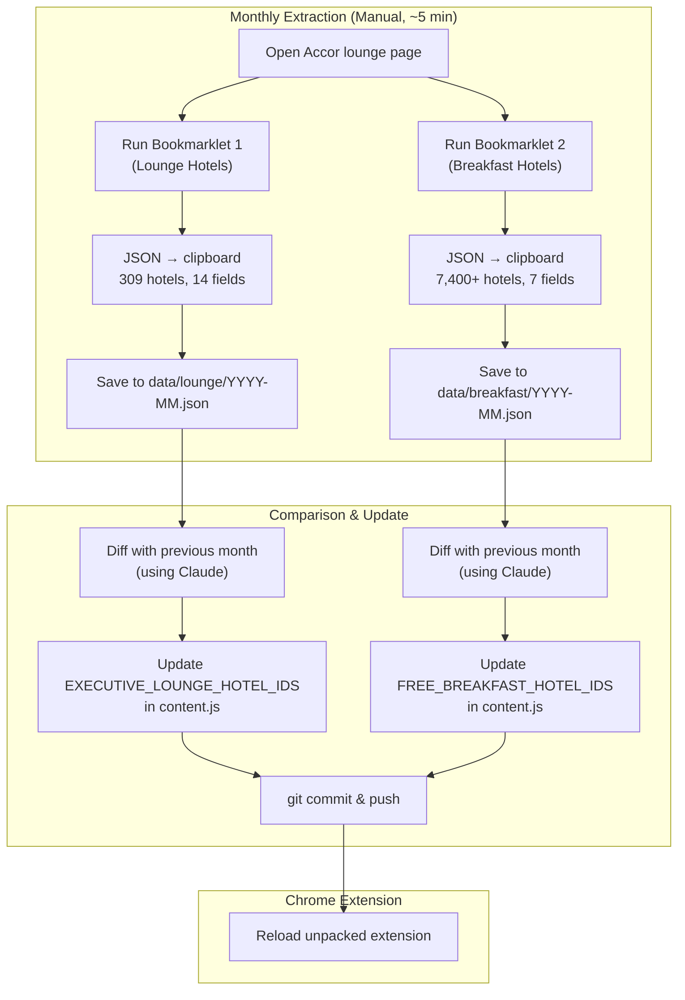
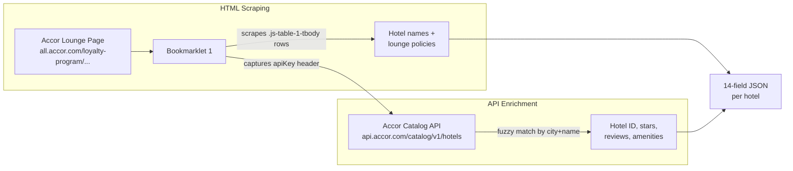
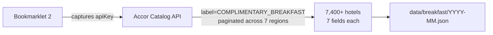
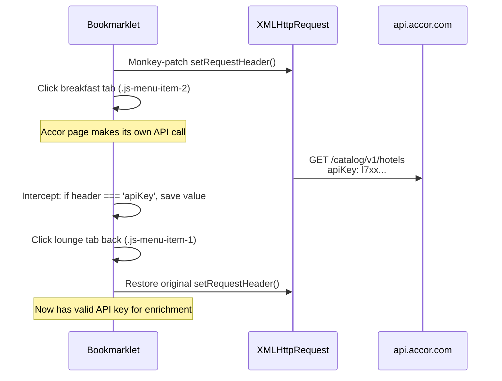
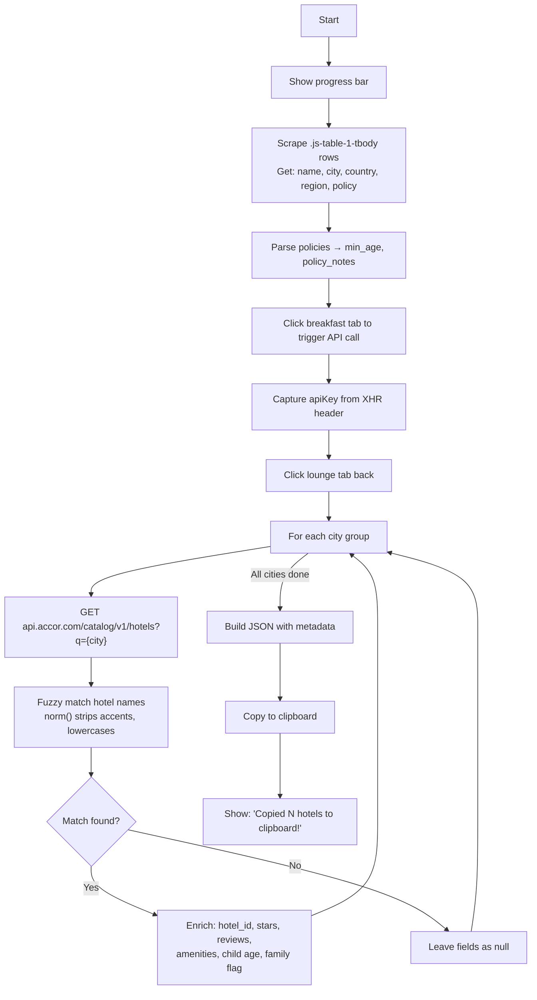
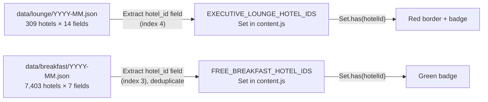

# Data Pipeline & Monthly Update Workflow

## Overview

The extension's hotel data is updated on the **1st of each month** using browser bookmarklets. There is no CI/CD, no automation — it's a manual 5-minute process.



## Data Sources

### Executive Lounge Hotels



**Why scraping?** There is NO API label or endpoint for Executive Lounge hotels. The data only exists as an HTML table on the Accor loyalty page.

### Complimentary Breakfast Hotels



Breakfast data is fully API-driven — no scraping needed.

## Data File Formats

### Lounge Hotels — 14 fields per hotel

```json
{
  "metadata": {
    "extracted": "2026-02-24",
    "source": "https://all.accor.com/loyalty-program/user/hotels-lounge/index.en.shtml",
    "region": "all",
    "total": 309,
    "matched": 245,
    "unmatched": 64,
    "format": "[region, country, city, hotel_name, hotel_id, lounge_policy, min_age, policy_notes, stars, review_score, review_count, max_child_age, family_friendly, key_amenities]"
  },
  "hotels": [
    [
      "asia",          // 1. region (continent slug)
      "thailand",      // 2. country slug
      "bangkok",       // 3. city slug
      "Sofitel Bangkok Sukhumvit",  // 4. hotel_name
      "1234",          // 5. hotel_id (null if unmatched)
      "Guests aged 16...",  // 6. lounge_policy (raw text)
      "16+",           // 7. min_age (parsed)
      "Time limits",   // 8. policy_notes (parsed)
      "5",             // 9. stars
      "4.3/5",         // 10. review_score
      "1205",          // 11. review_count
      "17",            // 12. max_child_age
      "",              // 13. family_friendly ("yes" or "")
      "pool, spa"      // 14. key_amenities
    ]
  ]
}
```

### Breakfast Hotels — 7 fields per hotel

```json
{
  "metadata": {
    "extracted": "2026-02-27",
    "source": "api.accor.com/catalog/v1/hotels?label=COMPLIMENTARY_BREAKFAST",
    "region": "all",
    "total": 7403,
    "format": "[region, brand, hotel_name, hotel_id, stars, review_score, review_count]"
  },
  "hotels": [
    [
      "asia",          // 1. region
      "Novotel",       // 2. brand
      "Novotel Bangkok Sukhumvit 20",  // 3. hotel_name
      "5678",          // 4. hotel_id
      "4",             // 5. stars
      "4.1/5",         // 6. review_score
      "892"            // 7. review_count
    ]
  ]
}
```

## Bookmarklet Architecture

### How API Key Capture Works

The bookmarklets intercept the Accor page's own API calls to capture the authentication key:



```javascript
var _oS = XMLHttpRequest.prototype.setRequestHeader;
XMLHttpRequest.prototype.setRequestHeader = function(k, v) {
  if (this._u && this._u.indexOf('api.accor.com') > -1 && k === 'apiKey')
    apiKey = v;  // Captured!
  return _oS.apply(this, arguments);
};
```

### Bookmarklet 1: Lounge Extraction Flow



### Bookmarklet 2: Breakfast Extraction Flow

```mermaid
flowchart TD
    A["Start"] --> B["Capture API key (same method)"]
    B --> C["For each of 7 regions"]
    C --> D["Paginated GET requests<br/>range=0-99, 100-199, ..."]
    D --> E{"More pages?<br/>(status 206 = partial)"}
    E -->|Yes| D
    E -->|No (200)| C
    C -->|"All regions done"| F["Build JSON"]
    F --> G["Copy to clipboard"]
```

### Name Matching Algorithm

The fuzzy matching `norm()` function handles Accor's inconsistent naming:

```javascript
function norm(n) {
  return n.toLowerCase()
    .replace(/[öô]/g, 'o')    // Mövenpick → Movenpick
    .replace(/[éè]/g, 'e')    // Café → Cafe
    .replace(/[àá]/g, 'a')
    .replace(/[üû]/g, 'u')
    .replace(/[ïî]/g, 'i')
    .replace(/ç/g, 'c')
    .replace(/[^\w\s]/g, '')   // Remove all non-alphanumeric
    .replace(/\s+/g, ' ')
    .trim();
}
```

Matching attempts (in order):
1. **Exact normalized match** — `aMap[h.norm]`
2. **Substring match** — `ks[i].indexOf(h.norm) > -1 || h.norm.indexOf(ks[i]) > -1`

### Known Mismatch Patterns

| Pattern | Lounge Page | API/Website |
|---------|-------------|-------------|
| City spacing | Pullman **HaiPhong** | Pullman **Hai Phong** |
| Word order | Novotel **Hong Kong Century** | Novotel **Century Hong Kong** |
| Abbreviation | Novotel Phnom Penh **BKK1** | Novotel Phnom Penh **BKK 1** |
| Apostrophes | Pullman Shanghai **Jing An** | Pullman Shanghai **Jing'an** |
| Name length | Fairmont La Marina Rabat **Salé Hotel And Residences** | Fairmont La Marina **Rabat-Salé** |

Unmatched hotels (~17%) must be resolved manually or via Bookmarklet 4.

## Monthly Update Checklist

```
□ 1. Open https://all.accor.com/loyalty-program/user/hotels-lounge/index.en.shtml
□ 2. Run "Extract All Lounge Hotels" bookmarklet (~3 min)
□ 3. Save clipboard → data/lounge/YYYY-MM.json
□ 4. Run "Extract All Breakfast Hotels" bookmarklet (~2 min)
□ 5. Save clipboard → data/breakfast/YYYY-MM.json
□ 6. Diff lounge with previous month (use Claude)
□ 7. Diff breakfast with previous month (use Claude)
□ 8. Update EXECUTIVE_LOUNGE_HOTEL_IDS Set if changed
□ 9. Update FREE_BREAKFAST_HOTEL_IDS Set if changed
□ 10. git commit & push
□ 11. Reload extension in chrome://extensions/
```

## Data Flow: From JSON to Runtime



The JSON data files are **reference/archival only** — the extension never loads them at runtime. All hotel IDs are compiled directly into `Set` literals in content.js.

---

*Back: [Page Bridge Deep Dive](Page-Bridge-Deep-Dive) | Next: [API Integration & Hotel ID Resolution](API-Integration-&-Hotel-ID-Resolution)*
