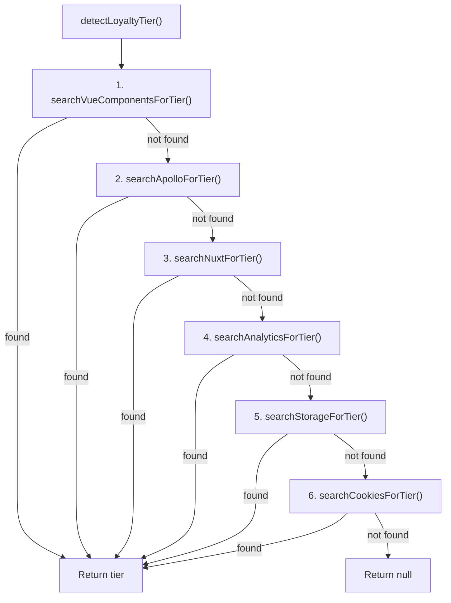
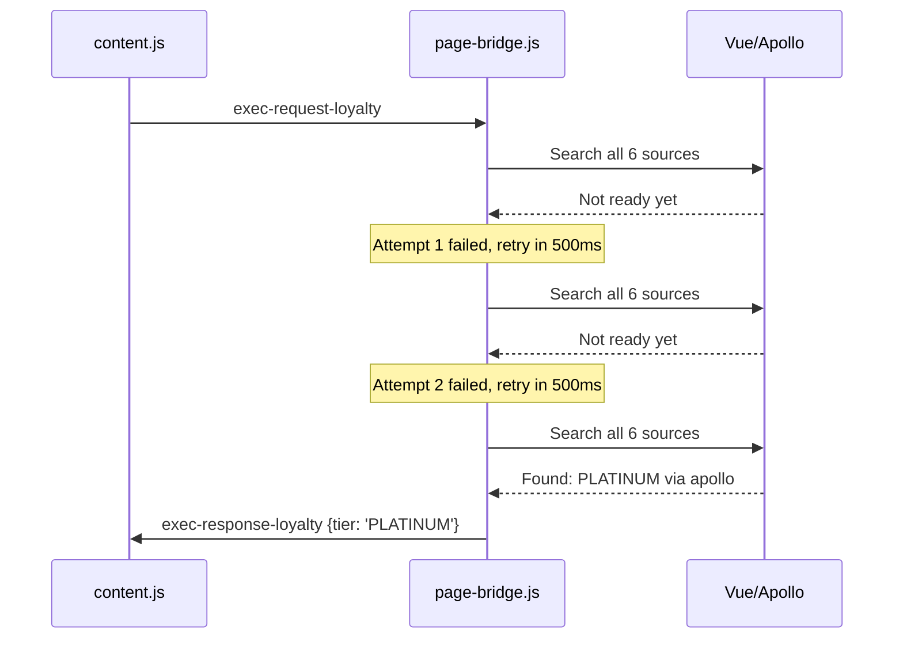
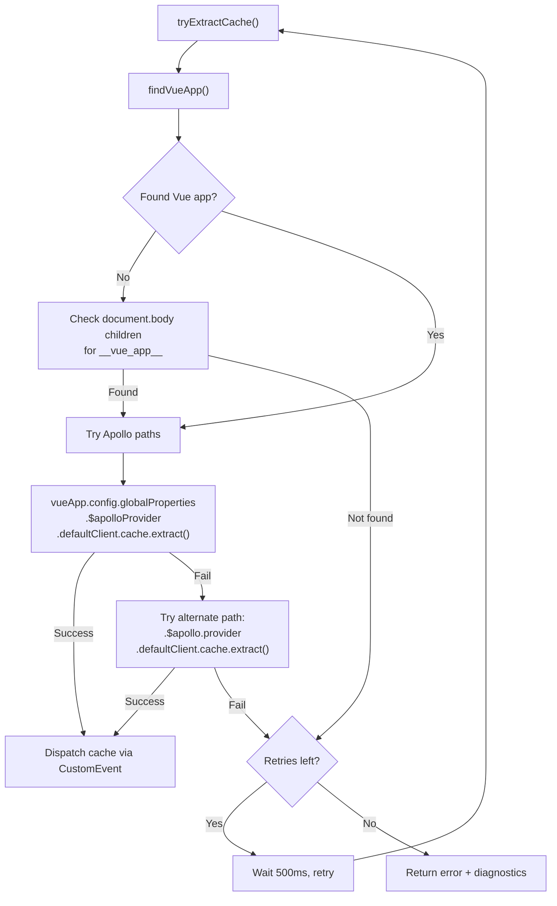

# Page Bridge Deep Dive

> `page-bridge.js` — 571 lines, runs in the MAIN world (page JS context)

## Purpose

The page bridge exists because Chrome extension content scripts run in an **isolated world** — they share the DOM with the page but cannot access the page's JavaScript globals. The Accor booking site is a Vue 3 + Nuxt SPA with an Apollo GraphQL cache containing all room rates and pricing data. To read this data, the bridge runs in the `MAIN` world where it has full access to `window`, Vue internals, and the Apollo cache.

**Trade-off:** MAIN world scripts cannot use `chrome.*` extension APIs. All communication with content.js is via `CustomEvent` on `document`.

## File Layout

```
Lines 1–4       Header
Lines 6–16      VALID_TIERS constant, normalizeTier()
Lines 18–40     TIER_FIELD_NAMES, deepSearchForTier()
Lines 42–75     searchApolloForTier()
Lines 77–121    searchNuxtForTier(), searchAnalyticsForTier()
Lines 123–194   ACCOR_CARD_TYPES, searchStorageForTier()
Lines 196–219   searchCookiesForTier()
Lines 221–304   searchVueComponentsForTier(), walkVueInstance()
Lines 306–320   detectLoyaltyTier() — orchestrator
Lines 322–488   tryExtractLoyalty() — retry loop + diagnostic dump
Lines 490–492   Event listener: exec-request-loyalty
Lines 494–515   findVueApp() — locate Vue 3 app instance
Lines 517–564   tryExtractCache() — Apollo cache extraction with retry
Lines 566–570   Event listener: exec-request-cache
```

## Loyalty Tier Detection

The bridge searches **6 sources** in priority order to detect the user's ALL loyalty tier:



### Source 1: Vue Components

Walks the Vue component tree starting from account/login button elements:

```javascript
const selectors = [
  '.button-logo__button--connected',  // Accor's logged-in account button
  '[class*="button-logo"]',
  '[class*="login-nav"]',
  '[class*="user-menu"]',
  '[class*="account-menu"]',
  // ... more selectors
];
```

For each matched element, it walks up the DOM to find Vue component instances, then searches their `data`, `props`, `setupState`, `ctx`, and `proxy` for tier-related fields.

### Source 2: Apollo Cache

Extracts the Apollo cache and searches keys matching `/user|member|loyalty|auth|profile|account|fidelity/i` for tier fields.

### Source 3: Nuxt SSR State

Checks `window.__NUXT__` containers: `state`, `data`, `payload`, and the root object.

### Source 4: Analytics Data Layers

Searches 4 analytics systems used by Accor:

| Global | System |
|--------|--------|
| `window.dataLayer` | Google Tag Manager |
| `window.utag_data` | Tealium |
| `window.tc_vars` | Commanders Act |
| `window.digitalData` | W3C Digital Data |

### Source 5: Storage

Checks known Accor storage keys first, then scans broadly:

```javascript
// Priority: known Accor keys
sessionStorage.getItem('loyalty-product-label');
sessionStorage.getItem('loyalty-card');

// ngStorage identification (legacy Accor format)
const idKeys = ['ngStorage-identification_all.accor', 'ngStorage-identification'];
// Maps card type codes: A1=CLASSIC, A2=SILVER, ..., A6=LIMITLESS
const ACCOR_CARD_TYPES = {
  'A1': 'CLASSIC', 'A2': 'SILVER', 'A3': 'GOLD',
  'A4': 'PLATINUM', 'A5': 'DIAMOND', 'A6': 'LIMITLESS',
};

// General scan: keys matching /user|member|auth|loyalty|profile|fidelity/i
```

### Source 6: Cookies

Scans cookies with names matching `/loyalty|tier|member|status|level|fidelity/i`.

### Deep Search Algorithm

All sources use the same recursive `deepSearchForTier()` function that looks for 18 known field names:

```javascript
const TIER_FIELD_NAMES = [
  'tier', 'loyaltyTier', 'status', 'memberStatus', 'loyaltyStatus',
  'level', 'tierCode', 'cardLevel', 'memberLevel', 'fidelityLevel',
  'user_tier', 'loyalty_tier', 'cardType', 'membershipLevel',
  'loyaltyLevel', 'fidelityStatus', 'card_level', 'tier_code'
];

function deepSearchForTier(obj, depth) {
  if (depth <= 0 || !obj || typeof obj !== 'object') return null;
  // Check known field names first
  for (const key of TIER_FIELD_NAMES) {
    if (obj[key]) {
      const t = normalizeTier(String(obj[key]));
      if (t) return { tierCode: t, field: key };
    }
  }
  // Recurse into nested objects
  for (const key of Object.keys(obj)) {
    if (typeof obj[key] === 'object' && obj[key] !== null) {
      const result = deepSearchForTier(obj[key], depth - 1);
      if (result) return result;
    }
  }
  return null;
}
```

### Tier Normalization

```javascript
const VALID_TIERS = ['CLASSIC', 'SILVER', 'GOLD', 'PLATINUM', 'DIAMOND', 'LIMITLESS'];

function normalizeTier(raw) {
  if (!raw || typeof raw !== 'string') return null;
  const upper = raw.toUpperCase().trim();
  if (VALID_TIERS.includes(upper)) return upper;        // Exact match
  for (const tier of VALID_TIERS) {
    if (upper.includes(tier)) return tier;               // Substring match
  }
  return null;
}
```

### Retry Logic

Both cache and loyalty extraction retry up to **15 times at 500ms intervals** (7.5 seconds total) to accommodate late-loading SPA data:



### Diagnostic Dump

On final failure (all 15 attempts exhausted), the bridge logs a comprehensive diagnostic to the console:

- Apollo cache keys and sample values
- Vue component tree around the account button
- Nuxt state keys
- dataLayer entries containing user data
- localStorage/sessionStorage keys with tier-related data
- Cookie names
- Window globals matching `/user|member|loyalty|fidelity|tier|auth/i`

This diagnostic output is invaluable for debugging when Accor changes their data structures.

## Apollo Cache Extraction



### Finding the Vue App

The bridge searches multiple locations for the Vue 3 app instance:

```javascript
function findVueApp() {
  // Try common root elements
  const candidates = ['#app', '#__nuxt', '#__layout', '[id]'];
  for (const sel of candidates) {
    const els = document.querySelectorAll(sel);
    for (const el of els) {
      if (el.__vue_app__) return el.__vue_app__;
      if (el.__vue__) return el.__vue__;    // Vue 2 fallback
    }
  }
  // Brute force: walk body children
  for (const el of document.body.children) {
    if (el.__vue_app__) return el.__vue_app__;
  }
  // Check Nuxt globals
  if (window.__NUXT__?.$apolloProvider) {
    return { config: { globalProperties: {
      $apolloProvider: window.__NUXT__.$apolloProvider
    }}};
  }
  return null;
}
```

### Apollo Cache Structure

The extracted cache contains entries like:

```javascript
{
  "BestOfferInfo:ABC123": {
    "accommodation": {
      "__ref": "Accommodation:DEF456",
      "name": "Deluxe Room",
      "code": "DEL"
    },
    "pricing": {
      "main": {
        "amount": 242,
        "formattedAmount": "A$242"
      },
      "formattedTaxType": "A$33 taxes & fees",
      "alternative": {
        "formattedAmount": "A$280"       // public price
      },
      "deduction": [{ "formattedAmount": "A$38" }]  // savings
    },
    "mealPlan": { "label": "Breakfast included" },
    "rate": { "__ref": "Rate:FLEXRATE" },
    "simplifiedPolicies": {
      "cancellation": {
        "label": "Free cancellation",
        "code": "FREE_CANCELLATION"
      }
    },
    "type": "ROOM"  // or "PACKAGE" for deals
  }
}
```

This is what powers the "Show All Rates" panel — each `BestOfferInfo:` entry becomes a row in the rate grid.

---

*Back: [Content Script Deep Dive](Content-Script-Deep-Dive) | Next: [Data Pipeline & Monthly Update Workflow](Data-Pipeline-&-Monthly-Update-Workflow)*
