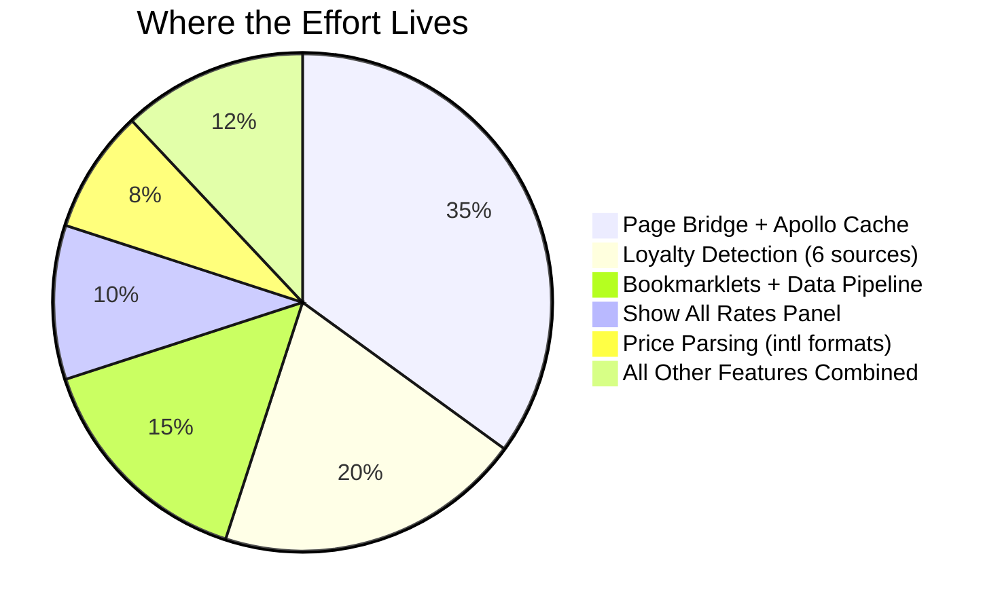

# Product Specification & Complexity Analysis

> Reference guide for rebuilding, scoping, or extending the extension.

## Feature Inventory by Complexity

| Feature | Complexity | Why | Lines |
|---------|-----------|-----|-------|
| Card highlighting (lounge + breakfast badges) | **Low** | DOM query + Set lookup + append div | ~40 |
| Lounge Only filter toggle | **Low** | Toggle class on/off, counter math | ~100 |
| Detail page badges | **Low** | URL parsing + same Set lookup | ~60 |
| Benefits box | **Low** | Conditional HTML generation | ~110 |
| SPA route detection | **Low** | setInterval polling location.href | ~25 |
| Upgrade eligibility | **Low** | Keyword-to-rank mapping, simple comparison | ~55 |
| Tax-inclusive price display (search) | **Medium** | International number parsing (US/EU formats), DOM surgery | ~130 |
| MutationObserver for infinite scroll | **Medium** | Re-entrancy guard (disconnect/reconnect pattern) | ~65 |
| Tax-inclusive price display (detail) | **Medium** | Depends on Apollo cache bridge working | ~60 |
| CSS injection (all styles) | **Medium** | Single <style> element, ~390 lines of CSS | ~390 |
| Show All Rates panel | **High** | Apollo cache parsing, offer-to-room matching, deduplication, 4-column grid | ~290 |
| Loyalty tier detection (6 sources) | **High** | Vue component tree walking, Apollo introspection, storage/cookie scanning, retry logic | ~490 |
| Two-world bridge (MAIN + ISOLATED) | **High** | CustomEvent protocol, Promise wrappers, timeout handling, Vue/Apollo discovery | ~80 |
| Monthly data pipeline (bookmarklets) | **High** | XHR interception, API pagination, fuzzy name matching, clipboard output | external |

## Effort Distribution

~70% of the effort is concentrated in 3 areas:
1. **Page bridge + Apollo cache reading** — reverse-engineering a Vue 3/Nuxt SPA's internal state
2. **Loyalty detection** — searching 6 data sources with 18 field names, walking Vue component trees
3. **Bookmarklets** — XHR monkey-patching for API keys, synchronous API calls, fuzzy name matching

The remaining ~30% is straightforward DOM manipulation (badges, borders, toggles, counters).

## What Makes It Tricky (Domain Knowledge, Not Code)

| Challenge | Impact | Documented In |
|-----------|--------|---------------|
| No API for lounge data | Forces HTML scraping + manual ID resolution | [Data Pipeline](Data-Pipeline-&-Monthly-Update-Workflow) |
| Accor's SPA architecture | Need MAIN world access to Vue/Apollo | [Architecture Overview](Architecture-Overview) |
| International price formats | `$1,350.00` vs `1.350,00 €` vs `¥135,000` | [Content Script Deep Dive](Content-Script-Deep-Dive) |
| ~17% unmatched hotel IDs | Manual resolution needed every month | [API Integration](API-Integration-&-Hotel-ID-Resolution) |
| Fragile DOM selectors | Any Accor redesign breaks the extension | [Content Script Deep Dive](Content-Script-Deep-Dive) |
| Apollo cache key formats | `BestOfferInfo:`, `Rate:`, `Accommodation:` refs | [Page Bridge Deep Dive](Page-Bridge-Deep-Dive) |
| 6 loyalty data sources | Vue components, Apollo, Nuxt, analytics, storage, cookies | [Page Bridge Deep Dive](Page-Bridge-Deep-Dive) |

## Rebuild Phases

If rebuilding from scratch with the wiki as a guide:

```mermaid
flowchart LR
    subgraph "Phase 1 — Foundation"
        A1["Manifest + two scripts"]
        A2["CustomEvent bridge"]
        A3["Card highlighting"]
        A4["MutationObserver"]
        A5["SPA route watcher"]
    end

    subgraph "Phase 2 — Price Features"
        B1["Intl price parsing"]
        B2["Tax-inclusive (search)"]
        B3["Apollo cache extraction"]
        B4["Tax-inclusive (detail)"]
    end

    subgraph "Phase 3 — Loyalty & Intelligence"
        C1["Loyalty tier detection"]
        C2["Benefits box"]
        C3["Upgrade eligibility"]
        C4["Show All Rates panel"]
    end

    subgraph "Phase 4 — Data Pipeline"
        D1["Lounge bookmarklet"]
        D2["Breakfast bookmarklet"]
        D3["ID resolution bookmarklet"]
        D4["Monthly workflow"]
    end

    A1 --> A2 --> A3 --> A4 --> A5
    A5 --> B1 --> B2 --> B3 --> B4
    B4 --> C1 --> C2 --> C3 --> C4
    C4 --> D1 --> D2 --> D3 --> D4
```

### Phase 1 — Foundation

| Task | Depends On | Key Reference |
|------|-----------|---------------|
| Create manifest.json (MV3, two content scripts, two worlds) | Nothing | [Architecture Overview](Architecture-Overview) |
| Build CustomEvent bridge (request/response pattern) | Manifest | [Architecture Overview → Inter-Script Communication](Architecture-Overview) |
| Hotel ID Sets (copy from data JSON files) | Nothing | [Data Pipeline → Data Flow](Data-Pipeline-&-Monthly-Update-Workflow) |
| Card highlighting (red border + badge, green badge) | Hotel ID Sets | [Content Script → Card Highlighting](Content-Script-Deep-Dive) |
| MutationObserver (disconnect/reconnect pattern) | Card highlighting | [Content Script → MutationObserver](Content-Script-Deep-Dive) |
| SPA route watcher (setInterval + cleanup + re-init) | init() function | [Content Script → SPA Route Change](Content-Script-Deep-Dive) |
| Lounge Only filter toggle | Card highlighting | [Content Script → Lounge Only Filter](Content-Script-Deep-Dive) |

### Phase 2 — Price Features

| Task | Depends On | Key Reference |
|------|-----------|---------------|
| `parseLocalizedNumber()` — US/EU format detection | Nothing | [Content Script → Price Parsing](Content-Script-Deep-Dive) |
| `parseCurrencyAmount()` — prefix/suffix currency extraction | parseLocalizedNumber | [Content Script → Price Parsing](Content-Script-Deep-Dive) |
| Tax-inclusive price on search cards | Price parsing | [Content Script → Tax-Inclusive Price](Content-Script-Deep-Dive) |
| Apollo cache extraction via bridge | CustomEvent bridge | [Page Bridge → Apollo Cache Extraction](Page-Bridge-Deep-Dive) |
| `findVueApp()` — locate Vue 3 app instance | MAIN world script | [Page Bridge → Finding the Vue App](Page-Bridge-Deep-Dive) |
| Tax-inclusive price on detail pages | Apollo cache | [Content Script → Detail Page Tax](Content-Script-Deep-Dive) |

### Phase 3 — Loyalty & Intelligence

| Task | Depends On | Key Reference |
|------|-----------|---------------|
| `normalizeTier()` + `deepSearchForTier()` | Nothing | [Page Bridge → Tier Normalization](Page-Bridge-Deep-Dive) |
| 6 loyalty search functions | deepSearchForTier | [Page Bridge → Loyalty Tier Detection](Page-Bridge-Deep-Dive) |
| Retry logic (15 attempts × 500ms) | Search functions | [Page Bridge → Retry Logic](Page-Bridge-Deep-Dive) |
| Diagnostic dump on failure | Retry logic | [Page Bridge → Diagnostic Dump](Page-Bridge-Deep-Dive) |
| Loyalty badge injection | Tier detection | [Content Script → Loyalty Badge](Content-Script-Deep-Dive) |
| Benefits box (search vs detail context) | Tier detection + Hotel ID Sets | [Content Script → Benefits Box](Content-Script-Deep-Dive) |
| Upgrade eligibility (room category ranking) | Tier detection | [Content Script → Upgrade Eligibility](Content-Script-Deep-Dive) |
| Show All Rates (offer matching + rate grid) | Apollo cache | [Content Script → Show All Rates](Content-Script-Deep-Dive) |

### Phase 4 — Data Pipeline

| Task | Depends On | Key Reference |
|------|-----------|---------------|
| API key capture (XHR monkey-patching) | Nothing | [Data Pipeline → API Key Capture](Data-Pipeline-&-Monthly-Update-Workflow) |
| `norm()` fuzzy name matching | Nothing | [API Integration → Normalization](API-Integration-&-Hotel-ID-Resolution) |
| Lounge extraction bookmarklet | API key capture + norm() | [Data Pipeline → Bookmarklet 1](Data-Pipeline-&-Monthly-Update-Workflow) |
| Breakfast extraction bookmarklet | API key capture | [Data Pipeline → Bookmarklet 2](Data-Pipeline-&-Monthly-Update-Workflow) |
| ID resolution bookmarklet | norm() | [API Integration → Manual Resolution](API-Integration-&-Hotel-ID-Resolution) |
| Monthly update workflow documentation | All bookmarklets | [Data Pipeline → Monthly Checklist](Data-Pipeline-&-Monthly-Update-Workflow) |

## Complexity Ratings

| Metric | Rating | Notes |
|--------|--------|-------|
| **Total lines of code** | ~2,900 | Small codebase |
| **Conceptual complexity** | **Medium-High** | Two-world bridge + reverse-engineering third-party SPA |
| **Maintenance burden** | **High** | Depends on Accor's DOM, Vue internals, Apollo cache format staying stable |
| **Domain knowledge required** | **High** | MV3 content script worlds, Vue 3 internals, Apollo cache, Accor-specific DOM/API |
| **Build/tooling complexity** | **None** | Zero dependencies, zero build steps, load unpacked |
| **Test coverage** | **None** | No tests, no CI/CD |

## Key Insight

The extension is **small in code but high in domain knowledge**. The code itself isn't complex — no state management framework, minimal async, no build system. But knowing *what* to read from the Accor page (which Apollo cache keys, which Vue component paths, which DOM selectors, which storage keys) is the real intellectual property.

That discovery work is documented across this wiki. Rebuilding with the wiki as a guide would be dramatically faster than the original build, because the wiki captures all the "where is the data and how do I get it" answers that took trial and error to figure out.

## Potential Improvements (Not Yet Implemented)

| Improvement | Effort | Impact |
|-------------|--------|--------|
| TypeScript migration | Medium | Better IDE support, catch bugs at compile time |
| Automated tests (Jest + jsdom) | Medium | Catch regressions, especially price parsing |
| GitHub Actions for data updates (Puppeteer) | High | Eliminate manual monthly process |
| Options page for user preferences | Low | Let users toggle features on/off |
| Webpack/Vite build | Low | Enable TypeScript, minification, source maps |
| Background service worker for caching | Low | Cache Apollo data across navigations |

---

*Back: [Architecture Overview](Architecture-Overview) | [Home](Home)*
