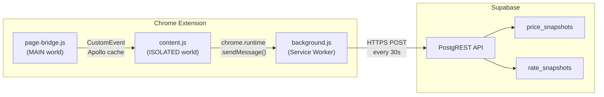
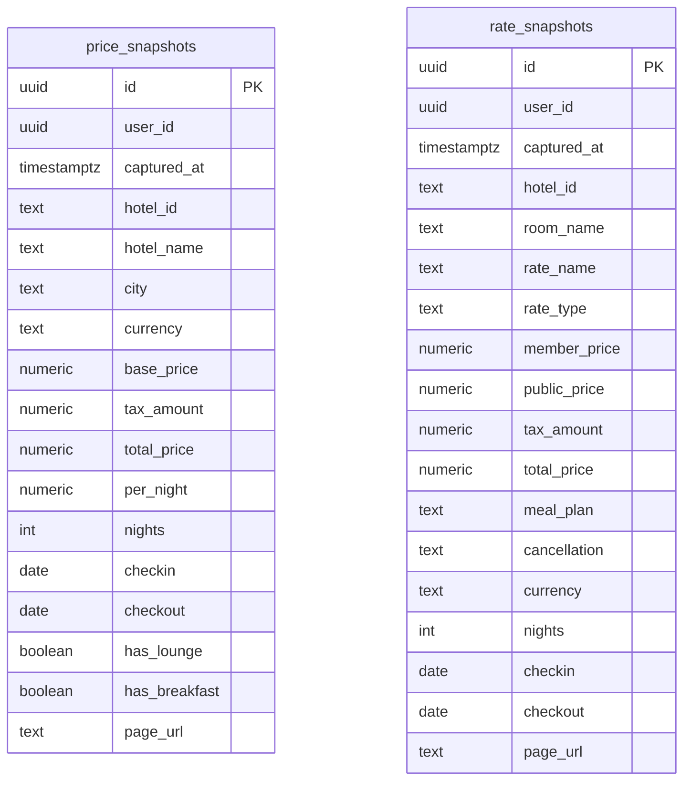
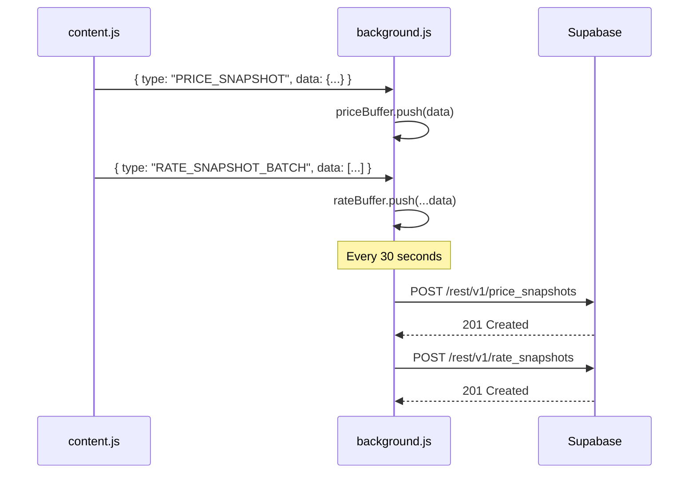

# Supabase Data Pipeline

> Collects hotel price and rate data as users browse Accor, sends it to Supabase for analysis, alerts, and price trend tracking.

## Architecture Overview



## Data Flow

### Search Page
1. User browses Accor search results
2. `addTaxInclusivePrice(card)` processes each hotel card
3. `parsePriceData(card)` extracts base price, tax, nights, currency
4. `sendPriceSnapshot(card, data)` sends to background worker via `chrome.runtime.sendMessage()`

### Detail Page
1. User views a hotel detail page with "Show All Rates" active
2. `injectAllRatePanels()` fetches Apollo cache and processes each room
3. `getOffersForRoom()` returns all rate offers for the room
4. `sendRateSnapshots(offers, hotelId, nights)` sends batch to background worker

### Background Worker
1. Receives `PRICE_SNAPSHOT` and `RATE_SNAPSHOT_BATCH` messages
2. Buffers rows in `priceBuffer[]` and `rateBuffer[]`
3. Every 30 seconds, flushes up to 50 rows per table to Supabase REST API
4. Failed batches are re-queued at the front of the buffer

## Supabase Setup

### 1. Create Account & Project

1. Go to [supabase.com](https://supabase.com) and sign up
2. Create a new project (name: `accor-lounge-data`, pick nearest region)
3. From **Settings > API**, copy:
   - **Project URL** (e.g., `https://xyzabc123.supabase.co`)
   - **anon (public) key**
4. Paste these into `config.js`:

```javascript
const SUPABASE_URL = 'https://xyzabc123.supabase.co';
const SUPABASE_ANON_KEY = 'eyJ...your-key-here';
```

### 2. Create Tables

Run this SQL in **Supabase SQL Editor**:

```sql
-- Enable UUID generation
CREATE EXTENSION IF NOT EXISTS "pgcrypto";

-- Search page price snapshots
CREATE TABLE price_snapshots (
  id            UUID DEFAULT gen_random_uuid() PRIMARY KEY,
  user_id       UUID NOT NULL,
  captured_at   TIMESTAMPTZ DEFAULT now(),
  hotel_id      TEXT NOT NULL,
  hotel_name    TEXT,
  city          TEXT,
  currency      TEXT,
  base_price    NUMERIC,
  tax_amount    NUMERIC,
  total_price   NUMERIC,
  per_night     NUMERIC,
  nights        INT,
  checkin       DATE,
  checkout      DATE,
  has_lounge    BOOLEAN DEFAULT false,
  has_breakfast BOOLEAN DEFAULT false,
  page_url      TEXT
);

-- Detail page rate snapshots
CREATE TABLE rate_snapshots (
  id            UUID DEFAULT gen_random_uuid() PRIMARY KEY,
  user_id       UUID NOT NULL,
  captured_at   TIMESTAMPTZ DEFAULT now(),
  hotel_id      TEXT NOT NULL,
  room_name     TEXT,
  rate_name     TEXT,
  rate_type     TEXT,
  member_price  NUMERIC,
  public_price  NUMERIC,
  tax_amount    NUMERIC,
  total_price   NUMERIC,
  meal_plan     TEXT,
  cancellation  TEXT,
  currency      TEXT,
  nights        INT,
  checkin       DATE,
  checkout      DATE,
  page_url      TEXT
);

-- Indexes
CREATE INDEX idx_price_hotel ON price_snapshots(hotel_id);
CREATE INDEX idx_price_user ON price_snapshots(user_id);
CREATE INDEX idx_price_captured ON price_snapshots(captured_at);
CREATE INDEX idx_rate_hotel ON rate_snapshots(hotel_id);
CREATE INDEX idx_rate_user ON rate_snapshots(user_id);
CREATE INDEX idx_rate_captured ON rate_snapshots(captured_at);

-- Row Level Security
ALTER TABLE price_snapshots ENABLE ROW LEVEL SECURITY;
ALTER TABLE rate_snapshots ENABLE ROW LEVEL SECURITY;

-- Anyone with anon key can INSERT (extension writes)
CREATE POLICY "anon_insert_prices" ON price_snapshots
  FOR INSERT WITH CHECK (true);
CREATE POLICY "anon_insert_rates" ON rate_snapshots
  FOR INSERT WITH CHECK (true);

-- Users can only SELECT their own data
CREATE POLICY "own_read_prices" ON price_snapshots
  FOR SELECT USING (
    user_id = COALESCE(
      (current_setting('request.jwt.claims', true)::json->>'sub')::uuid,
      '00000000-0000-0000-0000-000000000000'::uuid
    )
  );
CREATE POLICY "own_read_rates" ON rate_snapshots
  FOR SELECT USING (
    user_id = COALESCE(
      (current_setting('request.jwt.claims', true)::json->>'sub')::uuid,
      '00000000-0000-0000-0000-000000000000'::uuid
    )
  );
```

## Schema Diagram



## Key Files

| File | Role |
|------|------|
| `config.js` | Supabase URL and anon key constants |
| `background.js` | MV3 service worker — message batching, Supabase REST API |
| `content.js` | Data collection helpers (`sendPriceSnapshot`, `sendRateSnapshots`) + hooks |
| `manifest.json` | Registers service worker, storage permission, Supabase host |

## Message Protocol



## Multi-User Design

- Each extension install generates a persistent anonymous UUID via `crypto.randomUUID()`, stored in `chrome.storage.local`
- All rows include `user_id` for per-user data isolation
- RLS policies ensure users can only read their own data
- The anon key is a public key — safe to ship in the extension, scoped by RLS
- Future: upgrade to Supabase Auth (email/OAuth) for named user accounts

## Example Queries

### Average price per hotel over time
```sql
SELECT hotel_id, hotel_name,
  DATE_TRUNC('week', captured_at) AS week,
  AVG(total_price) AS avg_total,
  MIN(total_price) AS min_total,
  MAX(total_price) AS max_total,
  COUNT(*) AS samples
FROM price_snapshots
GROUP BY hotel_id, hotel_name, week
ORDER BY week DESC;
```

### Cheapest rate per room at a hotel
```sql
SELECT hotel_id, room_name, rate_name,
  MIN(member_price) AS best_member_price,
  MIN(public_price) AS best_public_price,
  meal_plan
FROM rate_snapshots
WHERE hotel_id = 'B4P0'
GROUP BY hotel_id, room_name, rate_name, meal_plan
ORDER BY best_member_price ASC;
```

### Price trend for a specific hotel
```sql
SELECT captured_at::date AS date,
  AVG(per_night) AS avg_per_night,
  currency
FROM price_snapshots
WHERE hotel_id = 'B4P0'
GROUP BY date, currency
ORDER BY date;
```

## Supabase Free Tier Limits

| Resource | Free Tier | Notes |
|----------|-----------|-------|
| Database | 500 MB | Ample for personal use |
| API requests | Unlimited | No rate limit concerns |
| Rows | Unlimited | Limited by storage only |
| Bandwidth | 5 GB/month | Minimal for JSON inserts |

---

*Back: [Architecture Overview](Architecture-Overview) | [Home](Home)*
